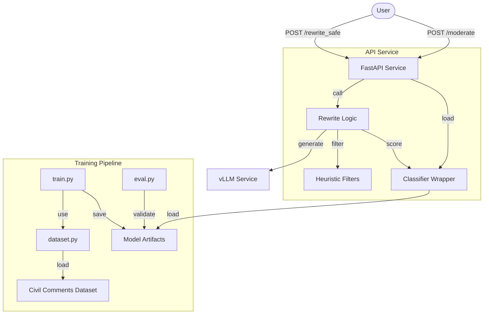

# ToxScreen — Scalable Toxicity Detection & Rewrite Service

Applied ML service that trains a multi-label toxicity classifier and provides an API for moderation and safe rewriting of text using vLLM as the inference backend.

## Architecture



## Features
- **Multi-label Classifier**: Trained on Civil Comments (DistilRoBERTa-base).
- **Safe Rewrite**: Best-of-N selection using vLLM and our classifier.
- **Heuristic Filters**: Regex-based detection for slurs and threats.
- **Production Ready**: JSON logging, request IDs, Docker support.

## Setup & Deployment

### Local Development
1. Install dependencies:
   ```bash
   pip install .
   ```
2. Train the classifier (requires a few thousand samples for a decent model):
   ```bash
   python classifier/train.py --model distilroberta-base --limit_train 50000 --limit_val 5000
   ```
3. Run the API:
   ```bash
   python api/main.py
   ```

### Docker (Recommended)
1. Configure `.env`:
   ```bash
   cp .env.example .env
   # Set VLLM_MODEL to your desired LLM (e.g. meta-llama/Llama-2-7b-chat-hf)
   ```
2. Start services:
   ```bash
   docker-compose up --build
   ```

## Model Card: Toxicity Classifier
- **Base Model**: `distilroberta-base`
- **Training Data**: Google Civil Comments (1.8M comments)
- **Labels**: Toxicity, Severe Toxicity, Obscene, Threat, Insult, Identity Attack, Sexual Explicit.
- **Threshold**: 0.5 for binary labels; 0.2 for rewrite selection.
- **Limitations**: May exhibit bias against certain identity groups mentioned in the dataset.

## API Usage Examples

### Moderation
```bash
curl -X POST http://localhost:8000/moderate \
  -H "Content-Type: application/json" \
  -d '{"text": "You are a total idiot!"}'
```

### Safe Rewrite
```bash
curl -X POST http://localhost:8000/rewrite_safe \
  -H "Content-Type: application/json" \
  -d '{"text": "Go to hell, you loser!", "n": 3, "debug": true}'
```

## Evaluation
Run the evaluation harness to generate a quality report:
```bash
python scripts/eval_rewrite.py --limit 100
```
Reports will be saved in `reports/rewrite_eval.md`.
